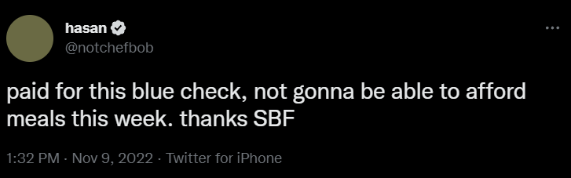
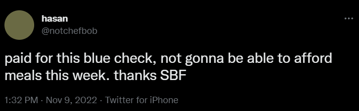

# Twitter Blue Verified Check Remover
Chrome extension to remove verified check from Twitter Blue users while keeping them for regular verified users.

Works by intercepting all Twitter API requests at the XHR level so should theoretically remove Twitter Blue users from the verified tab as well (untested)

Before:



After:



## Install

```
1. Clone or download the repository
2. Head over to `chrome://extensions`
3. Enable developer mode
4. Load unpacked extension by selecting the downloaded folder
```